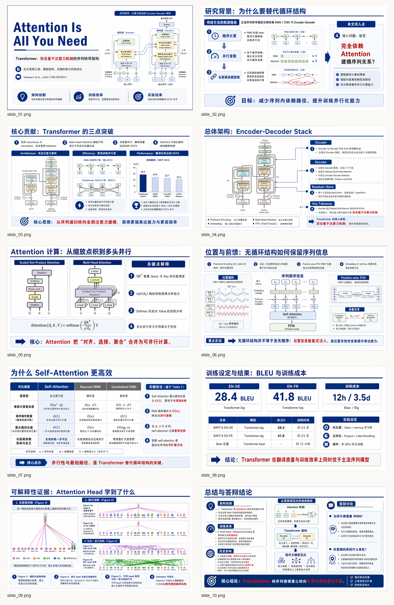
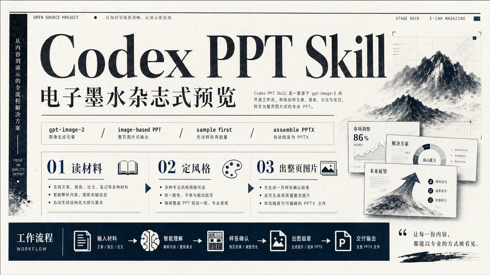
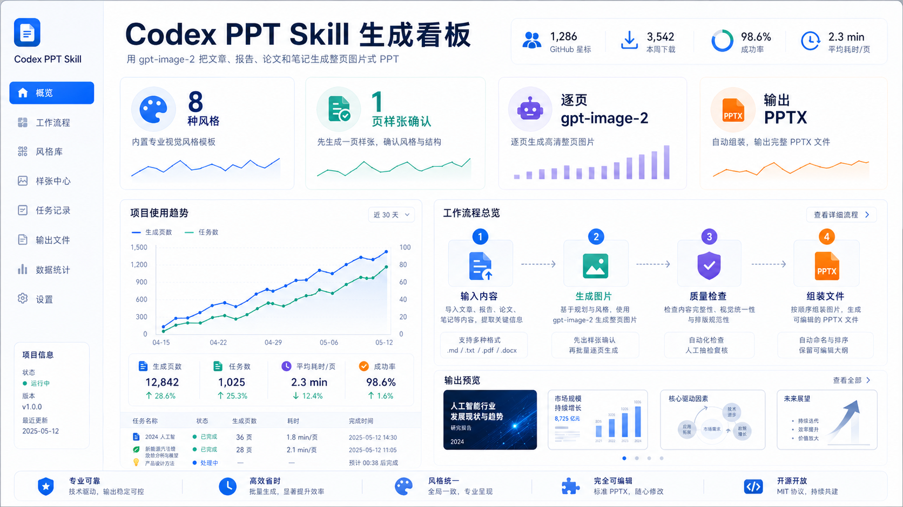
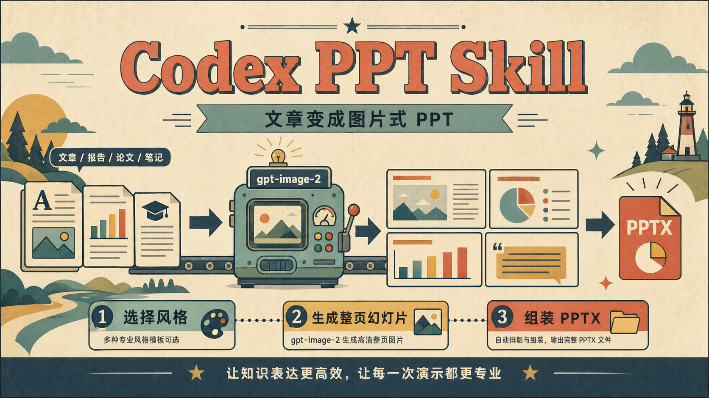
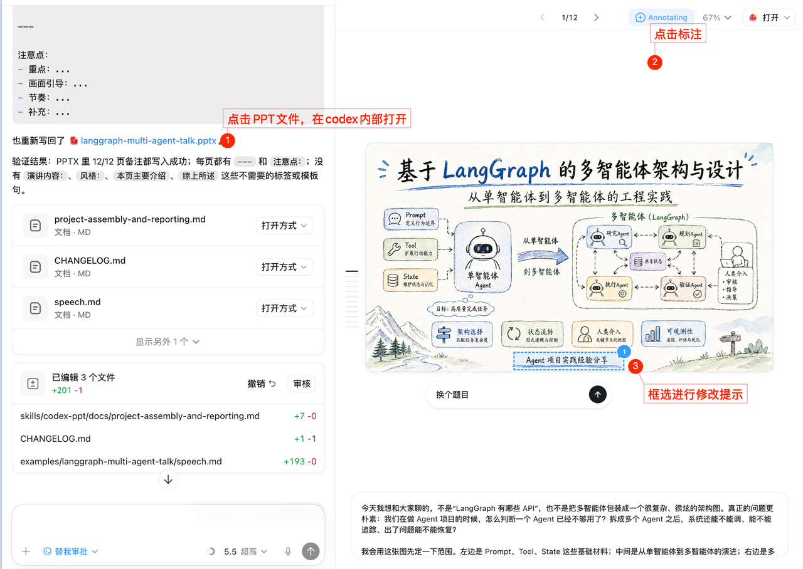

# Codex PPT Skill

[](README.md) [](https://clawhub.ai/ningzimu/codex-ppt) [](https://github.com/ningzimu/codex-ppt-skill/stargazers) [](https://github.com/ningzimu/codex-ppt-skill/forks)

A Codex skill for generating PowerPoint decks. It can also be used in Claude Code, OpenClaw, Hermes Agent, and other agents that support `SKILL.md`; these non-Codex environments usually require configuring `gpt-image-2` or a third-party OpenAI-compatible image generation API. It turns articles, reports, papers, course notes, and other source materials into image-based presentations: first plan the outline and visual style, then generate each full-slide image, and finally assemble the images into a `.pptx` file with a local script.

> [!TIP]
> This skill generates image-based PPT decks from articles, reports, outlines, or ideas. It is suitable for strong visual expression, but slide elements are not directly editable. If you need a more editable PPT, you can try converting the generated deck with [image-to-editable-ppt-skill](https://github.com/ningzimu/image-to-editable-ppt-skill).
>
> For a detailed introduction to `codex-ppt` and `image-to-editable-ppt`, see [skill_duo_intro.pdf](assets/skill_duo_intro.pdf). This deck was generated with the `codex-ppt` skill using the prompt: "请分别阅读 Codex PPT和 Image to Editable PPT 这两个技能的内容，然后用 Codex PPT 帮我做一个PPT吧，20页，每个技能的介绍10页。"

> [!NOTE]
> To see more PPT examples made by users with this skill, visit the pinned showcase issue: [欢迎分享 codex-ppt 使用案例和 PPT 效果](https://github.com/ningzimu/codex-ppt-skill/issues/34).

## Friendly Note

This skill is meant to provide a solid PPT generation workflow. To stay broadly useful, the workflow is a little more complex than most people need every day, and that complexity can sometimes add instability or redundant choices. For example, it supports both Codex built-in image generation and API/CLI fallback generation, and it also supports workflows with or without subagents. Most users will eventually use only one of those paths.

After you have a route working, consider asking an AI assistant to edit this skill and lock in your own preferences, such as your preferred image backend, whether to use subagents, output directory conventions, visual styles, or slide pacing. That way you do not need to make the same choices every time.

If you find a layout or visual style you like while making decks, whether it was generated by this skill or found elsewhere, you can ask AI to add it to this skill's `references/` directory and gradually build your own style library. Skills are highly personal workflows; tune this one around your own habits so it becomes more useful for your actual work.

For a basic introduction to skill design and usage, see [good-skill-design.pptx](assets/good-skill-design.pptx). That deck was also made with this skill, using the hand-drawn technical explainer style, and is based on Claude's skill design best-practices article [The Complete Guide to Building Skills for Claude](https://resources.anthropic.com/hubfs/The-Complete-Guide-to-Building-Skill-for-Claude.pdf).

## Features

- Works across multiple agents: supports Codex, Claude Code, OpenClaw, Hermes Agent, and other `SKILL.md`-based environments; Codex is the recommended environment because it can use the built-in image generation and image editing tools first.
- Supports third-party proxy APIs: works with OpenAI-compatible endpoints, `base URL`, and custom model names, so API/CLI fallback can use `gpt-image-2` or compatible image models.
- Stable staged workflow: confirms the outline, slide count, visual style, image backend, and sample slide before full-deck generation, reducing drift and rework when generating a complete PPT.
- Guided instead of one-shot: the skill asks you to confirm `outline.md`, per-slide key points, style direction, and sample-slide quality before continuing.
- Low setup effort: articles, reports, papers, course notes, Markdown files, outlines, PDFs, and Word documents can all be used as starting material.
- 10 built-in PPT style references: includes clean professional, scientific defense, e-ink magazine, hand-drawn technical explainer, dashboard, McKinsey style, and more. The hand-drawn technical explainer style is a strong starting point if you do not want to write prompts.
- Supports custom style replication: provide a favorite image, PDF, or PPT/PPTX, and the agent can analyze its color, layout, typography, and visual system before generating a new deck in that style.
- Builds a reusable personal style library: once you like a deck style, ask the agent to save it into this skill's `references/` directory so future decks can reuse it directly.
- Supports parallel subagent generation: after the sample slide is approved, one subagent can handle one slide and self-check readability, style consistency, and content completeness before reporting issues for repair.
- Supports required image insertion: assign paper figures, experiment charts, screenshots, architecture diagrams, or other images to specific slides, and the generated page will adapt the layout and theme around them.
- Generates speaker notes: creates `speech.md` and writes the notes into each slide during PPTX assembly, making the deck easier to present or revise.

## Output Example

Below is an example technical sharing deck. Each page is a complete 16:9 slide image generated by `gpt-image-2`, then assembled into a PPTX file by the local script.


Below is a scientific defense example based on the paper [Attention Is All You Need](https://arxiv.org/abs/1706.03762). It shows how to assign original paper figures to specific slides as input assets, such as the model architecture, attention modules, and attention visualizations, then generate a coherent deck around those figures (see Issue #14).



## Style Examples

The following preview images were generated with `gpt-image-2` to help users choose a visual direction before production.

| Clean Professional | Creative Magazine |
| --- | --- |
|  |  |
| E-ink Magazine | Data Dashboard |
|  |  |
| Retro Flat Illustration | Hand-drawn Technical Explainer |
|  |  |
| Hand-drawn Whiteboard | Warm Handmade |
|  |  |
| Scientific Defense | McKinsey Style |
|  |  |

## Output Structure

Each PPT is generated into an independent project directory:

```text
{base_dir}/{deck_name}/     # Independent project directory for this deck
├── origin_image/           # Final slide images only
│   ├── slide_01.png        # Slide 1 image
│   ├── slide_02.png        # Slide 2 image
│   └── ...                 # Additional slide images, named in slide order
├── outline.md              # Confirmed outline, slide count, titles, and key points
├── speech.md               # Speaker notes written into the PPT
└── {deck_name}.pptx        # Final assembled PowerPoint file
```

Use `origin_image/` to review the final image used for each slide. Files are named in order as `slide_01.png`, `slide_02.png`, and so on, which makes it easy to preview the deck visually or ask for one specific slide to be revised.

`speech.md` is the companion talk track. When the `.pptx` is assembled, the content is written into each slide's speaker notes so you can view, edit, or use it directly while presenting in PowerPoint.

## Use Cases

- Turn technical articles into sharing decks.
- Turn papers or reports into presentations.
- Turn course notes into teaching slides.
- Create decks for research proposals, midterm reviews, final project acceptance, and thesis defenses.
- Create business reports, product introductions, and research summaries.
- Produce image-based presentations that require strong visual consistency.

## Installation

### Codex

Use the `skills` CLI to install this skill into Codex's global skills directory:

```bash
npx -y skills@latest add ningzimu/codex-ppt-skill \
  --skill codex-ppt \
  --agent codex \
  --global
```

Restart Codex after installation so the new skill is picked up.

You can also download `codex-ppt-skill-v*.zip` from GitHub Releases, unzip it, place the contained `codex-ppt` directory at `~/.codex/skills/codex-ppt`, and then restart Codex.

If you are developing this repository locally, you can instead symlink the skill directory into the Codex skills directory so changes are reflected immediately:

```bash
mkdir -p ~/.codex/skills
ln -s /path/to/codex-ppt-skill/skills/codex-ppt ~/.codex/skills/codex-ppt
```

### OpenClaw

Install from ClawHub:

```bash
openclaw skills install codex-ppt
```

ClawHub page: [clawhub.ai/ningzimu/codex-ppt](https://clawhub.ai/ningzimu/codex-ppt)

If you use OpenClaw skill allowlists, add `codex-ppt` to the allowed skills.

### Claude Code and Hermes Agent

These agents can read `SKILL.md` skills. The recommended path is to install with the `skills` CLI:

```bash
# Claude Code
npx -y skills@latest add ningzimu/codex-ppt-skill \
  --skill codex-ppt \
  --agent claude-code \
  --global

# Hermes Agent
npx -y skills@latest add ningzimu/codex-ppt-skill \
  --skill codex-ppt \
  --agent hermes-agent \
  --global
```

Common target directories are `~/.claude/skills/codex-ppt` for Claude Code and `~/.hermes/skills/codex-ppt` for Hermes Agent.

If you are developing this repository locally, you can use a symlink instead of copying so changes are reflected immediately.

## Image Model Configuration

> [!TIP]
> You can start using Codex PPT normally to make a deck. In most cases, you do not need to configure the image model by hand; when the workflow asks you to choose an image backend, the AI will check the current environment and guide you through any required information.
>
> - If you use Codex's built-in image generation, you usually do not need an extra API key.
> - If you use a third-party API or an OpenAI-compatible proxy, send the AI that provider's documentation for using `gpt-image-2` first, then let it read the docs and configure the relevant scripts and parameters.

The manual configuration notes below mainly apply to API/CLI fallback. Asking for a specific resolution, higher quality, or edits to one slide does not by itself trigger third-party API configuration. Typical cases that require configuration include:

- Using a third-party API or OpenAI-compatible proxy in Codex, where the built-in image generation tool is usually unavailable.
- Using this skill from Claude Code, OpenClaw, Hermes Agent, or similar agents.

If you use Codex through a GPT subscription and Codex's built-in image generation tool is available, you do not need to configure `gpt-image-2` separately. Even if your prompt says “use `gpt-image-2`”, you can usually keep using Codex's built-in image generation and do not need to prepare an API key.

If you do need an external image API, the config is written to `~/.codex-ppt-skill/.env`. Add a `base URL` only when using a third-party proxy. The model defaults to `gpt-image-2`; change it only if your proxy requires a different model name. Once configured, Codex, Claude Code, OpenClaw, and Hermes Agent can share the same settings.

If you need to configure or troubleshoot it manually, you can run the config command directly:

```bash
python3 /path/to/codex-ppt-skill/skills/codex-ppt/scripts/codex_ppt_runtime.py config \
  --api-key "your-api-key" \
  --model gpt-image-2
```

`--api-key` is your API key. `--model` is the image model name, and `gpt-image-2` is the default choice. The config is written to `~/.codex-ppt-skill/.env`. Do not write API keys into the project directory or commit them to the repository.

If you use a third-party proxy, add `--base-url`. If the proxy uses a custom model name, replace `--model` with the name provided by that proxy:

```bash
python3 /path/to/codex-ppt-skill/skills/codex-ppt/scripts/codex_ppt_runtime.py config \
  --api-key "your-api-key" \
  --base-url "https://your-openai-compatible-endpoint/v1" \
  --model openai/gpt-image-2
```

## Usage

Ask Codex, Claude Code, OpenClaw, or Hermes Agent and explicitly specify the `codex-ppt` skill, for example:

```text
Use the codex-ppt skill to turn /path/to/article.md into a roughly 10-slide PPT.
```

The skill follows this workflow:

1. Read the source content and plan the deck outline.
2. Generate `outline.md` and ask you to confirm slide count, slide titles, and key points.
3. Offer 2-3 visual style options and recommend one for user confirmation.
4. State the image generation backend before the first image and ask you to confirm it.
5. Generate one sample slide with the confirmed image backend for approval of style, layout rhythm, and text quality.
6. Create the PPT project directory.
7. Generate all slide images one by one with the same image backend.
8. Check text readability, style consistency, and content completeness.
9. Generate `speech.md`.
10. Assemble the `.pptx` with `assemble_ppt.py`.
11. Optional: if you really like the generated PPT style, save it to the style library; if it already uses a built-in style, you do not need to save it again.

## Usage Tips

- The default script resolution is 2K 16:9 landscape. This setting mainly applies when you provide a third-party `gpt-image-2` API or OpenAI-compatible proxy and use API/CLI fallback; in that path, ask the AI to switch to 4K if slide images look blurry, especially on text-heavy pages. Codex subscribers use the built-in image generation tool by default, and that built-in tool does not currently expose a manual resolution setting. If you do not want to buy a third-party `gpt-image-2` API but still want 4K-level decks with your subscription, combine this skill with [ningzimu/codex-gpt-image](https://github.com/ningzimu/codex-gpt-image), which uses your member login and calls `gpt-image-2` through an API-style workflow before pairing with Codex PPT for high-resolution slide generation.
- If you are unhappy with one specific slide's content, layout, colors, or wording, ask the current agent to refine that slide in detail instead of regenerating the whole deck.



- You can also provide PPT style references you like — a single screenshot, multiple screenshots, or a full PPT/PDF. Ask the current agent to analyze the colors, layout, typography, and visual elements first, then generate a new deck in that style. Once the result looks good, you can ask the agent to save the style into this skill's `references/` directory for future reuse.
- If you need to include paper figures, experiment charts, screenshots, or architecture diagrams, specify the target slide and role for each image in the outline.

## QA

- Feishu doc: [codex-ppt FAQ and usage notes](https://icn42st819e7.feishu.cn/wiki/WKIvw81DqinKzcknjiZcbhTMniW?from=from_copylink)

## Community

Scan the QR code to join the Skill community group, share usage experience, report issues, and receive update notices.


## License

MIT

## Star History

[](https://www.star-history.com/#ningzimu/codex-ppt-skill&Date)
